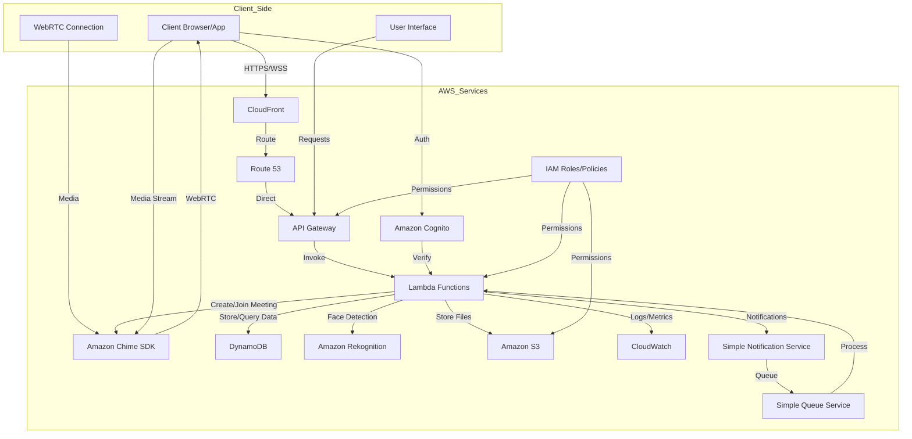
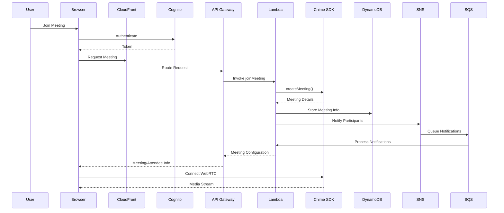
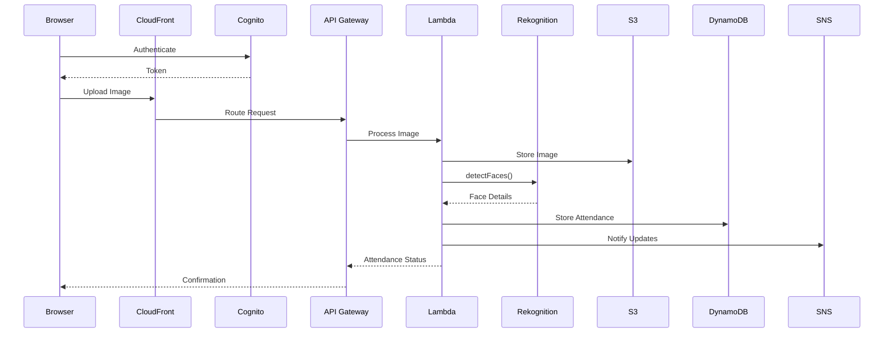
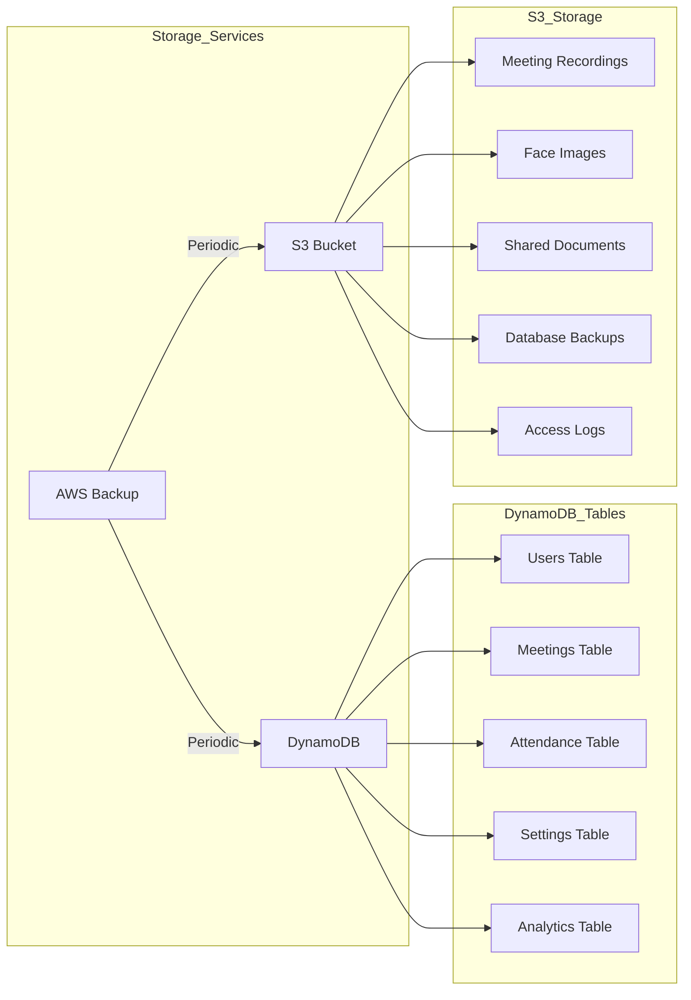
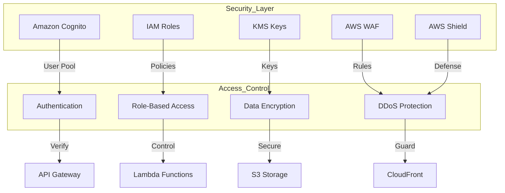
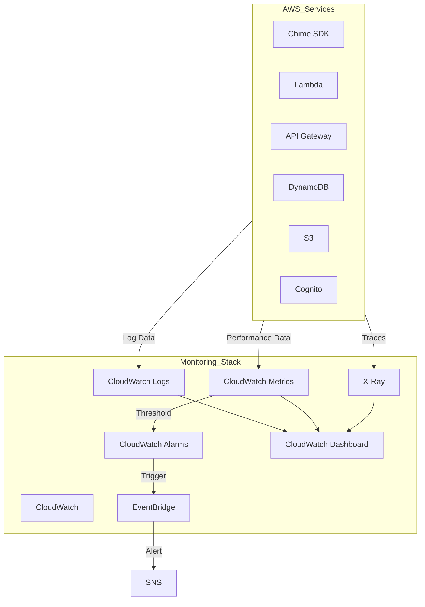

# EduConnect System Architecture and Data Flow Diagrams

## 1. Complete System Architecture

## 2. Enhanced Video Call Flow

## 3. Enhanced Face Detection Flow

## 4. Enhanced Data Storage Architecture

## 5. Enhanced Security Architecture

## 6. Enhanced Monitoring Architecture

## Key Features of the Updated Architecture:

1. **Enhanced Serverless Architecture**
   - API Gateway with CloudFront distribution
   - Lambda functions with X-Ray tracing
   - DynamoDB with backup and analytics
   - S3 with lifecycle management
   - SNS/SQS for asynchronous processing

2. **Comprehensive Security**
   - Cognito user authentication
   - WAF protection
   - Shield DDoS protection
   - KMS encryption
   - IAM role-based access

3. **Advanced Monitoring**
   - CloudWatch comprehensive monitoring
   - X-Ray distributed tracing
   - EventBridge event handling
   - Custom metrics and dashboards
   - Automated alerting

4. **High Availability**
   - Multi-AZ deployment
   - CloudFront global distribution
   - Route 53 DNS management
   - Auto-scaling capabilities
   - Backup and disaster recovery

5. **Performance Optimization**
   - CloudFront caching
   - DynamoDB DAX
   - Lambda provisioned concurrency
   - S3 transfer acceleration
   - WebRTC optimization

6. **Cost Management**
   - Lambda execution optimization
   - S3 intelligent tiering
   - DynamoDB auto-scaling
   - CloudFront price class selection
   - Reserved capacity options

*Note: These diagrams are created using Mermaid.js syntax and can be rendered in markdown-supporting platforms. The architecture includes all AWS services used in the EduConnect project with their complete interactions and data flows.*